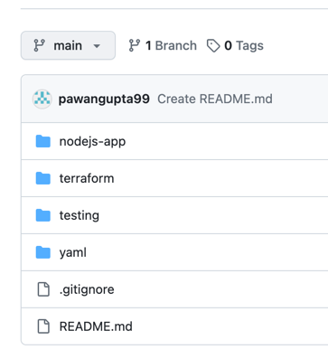
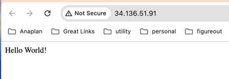
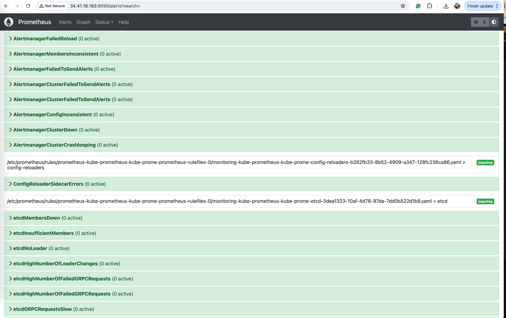
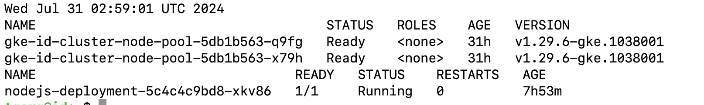
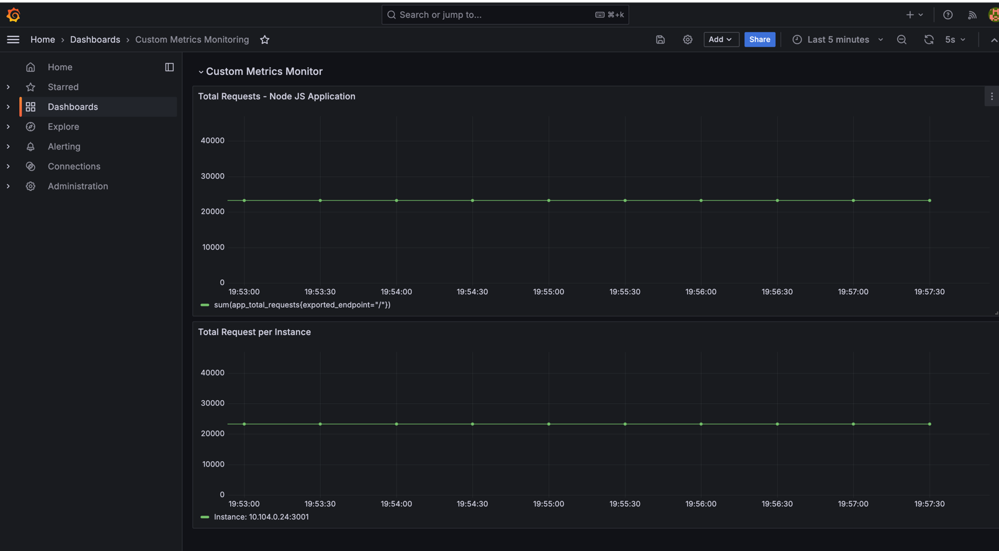
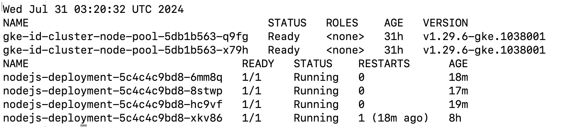
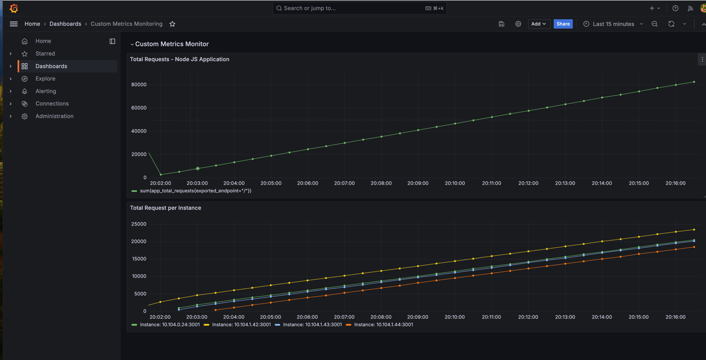
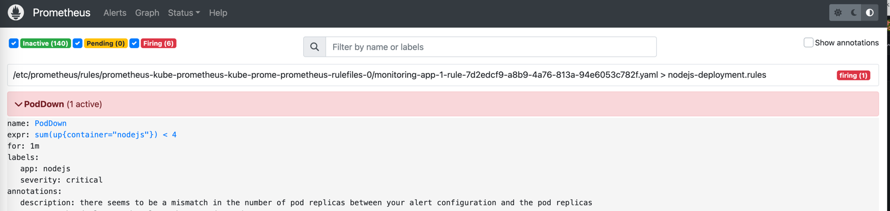

## Tech Stack:

**Infrastructure as code** - Terraform  
**Programming Language/UI** - Node JS  
**Backend storage** - MongoDB  
**Kubernetes resource creation** - YAML  
**Monitoring** - Prometheus Operator and Grafana    

## Important Links:

**UI**: http://34.136.51.91/
 
Endpoints to view metrics on UI as well: http://34.136.51.91/metrics
 
**Prometheus**: http://34.41.18.183:9090/graph
 
**Grafana**: http://34.66.2.254/d/adt9qu7hfrdhcf/custom-metrics-monitoring  
Login Credentials:  iduser/Grafana1#2  (Read only user)

## Repo structure:

**nodejs-app**: This contains the Node based simple application that makes the mongo db connection and fetch the data from mongo db when the UI is accessed.
Additionally it also is responsible for creating custom metric that will be utilized for additional monitoring of this service.
More details captured in Monitoring section below.
It contains the docker file as well.

**terraform**: Used terraform scripts to create GKE cluster and a node pool

**testing**: This contains script to scale test the UI access.

**yaml**: Contains major yamls for web deployment and service, **Horizontal Pod Autoscaler**, Monitoring and Alerting

 

## Implementation Details

**Cluster Autoscaler**: GKE's cluster autoscaler is enabled for our Kubernetes cluster, automatically resizing the number of nodes in the node pool based on workload demands.

**HorizontalPodAutoscaler**: This feature allows us to scale deployments and stateful sets according to workload requirements.

**MongoDB Operator**: The MongoDB operator streamlines the setup of network configurations, persistent storage, and dedicated computing resources for each container, minimizing the need for manual intervention.

### **Monitoring** 

We are monitoring **CPU and Memory Usage** of Node JS Application and Mongo DB service. Also we are monitoring the **total number of active requests** for the web application as this gives the 360 degree view of application and scaling requirement.

* **Prometheus Operator for Monitoring**: The Prometheus operator facilitates the monitoring of various Kubernetes metrics, such as pod health, CPU, and memory usage. We also track custom metrics, including total and active requests in real-time.

* **Custom Metrics Monitoring and Alerting**: We've set up alerts to notify us if the number of active pods for our application drops below three at any time.

 

## Implemention:
Node Js service makes a connection to Mongo DB to get the home page content from the DB table  

  **Prometheus:**    

### **Scaling** 
When the large number of requests are hits on the node service, the pods starts scaling up and later they scale down automatically when the load starts decreasing.

#### **Before Scaling** 
Below is the initial state of the pod before scaling done through stress testing:

Initial Pod State and Count:
  
Monitoring:

#### **After Scaling** 

After Pod State and Count:   

After scale testing, Pods are scaled up to  **4 from 2.**

  

### **Monitoring Application Pods** 

### **Monitoring MongoDb Pods** 

### Alerting for Application Pod
Alerting for the minimum number of Pods running by the app. This Alerts can be further integrated with Slack/Pager Duty  

